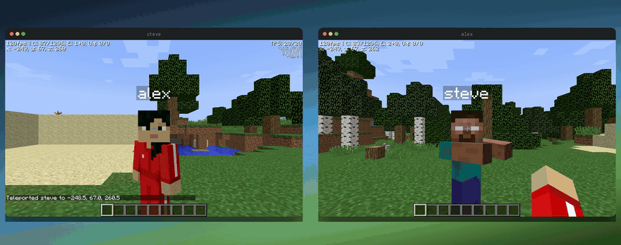

# terminal-eaglercraft

Minecraft inside your terminal, and inside your friend's terminal, in the same
world.



Two terminal panes, two players, one Minecraft world. The full clip, with the
game's own sound, is [media/terminal-eaglercraft.mp4](media/terminal-eaglercraft.mp4).
Every frame in both is bytes terminal-browser wrote to a terminal.

### Install (macOS & Linux):

```bash
curl -fsSL https://raw.githubusercontent.com/dcouple/terminal-eaglercraft/main/install.sh | bash
```

This repository is the wrapper. The installer downloads the game itself, one
74 MB EaglercraftX 1.8 html file, from the Eaglercraft archive on GitHub, pinned
to an exact commit and checked against a pinned sha256 before it is used.

### Usage

```
Usage: terminal-eaglercraft [options]

  terminal-eaglercraft                 Play in this terminal pane
  terminal-eaglercraft --split right   Play in a new pane beside what you are doing

Options:
  --client <path>       Use your own EaglercraftX offline client html
  --look <pixels>       Look speed for the arrow keys, in pixels of mouse
                        movement per second (default 520)
  --relay <wss url>     Signal shared worlds through this relay instead of the
                        ones the client ships with
  --split <direction>   Open in a new pane: right, left, down, up
  --size <fraction>     How much space a new split takes (0.2 to 0.95)
  --port <n>            Serve the game on this port (default 25585)
  --serve               Only start the server and print its url
  --windowed            Keep the browser toolbar, for debugging
  --debug               Print what the page is told about the mouse and keys
  --version             Print the version
  -h, --help            Print this help
```


You need a terminal that speaks the kitty graphics protocol: ghostty, kitty,
WezTerm, cmux, or the terminal inside VS Code. On macOS, `brew install --cask
ghostty`.

Fullscreen the terminal before you play. The game renders at whatever size the
pane is, so a bigger pane is a bigger, sharper Minecraft. The recording above
was made at 170 by 48 cells, which is 1530 by 912 pixels.

The first launch shows a white screen that says "press any key to enable sound".
Press any key. Chromium keeps audio silent until you touch something, and
Eaglercraft waits there until you do.

### Controls

| Action | Key |
| --- | --- |
| Move | `W` `A` `S` `D` |
| Look | arrow keys, or the mouse |
| Jump | `space` |
| Sneak | `shift` |
| Sprint | `left ctrl`, or double tap `W` |
| Fly, in creative | double tap `space` |
| Mine, attack | left click |
| Place, use | right click |
| Inventory | `E` |
| Hotbar | `1` to `9` |
| Drop | `Q` |
| Chat and commands | `T` |
| Camera | `F5` |
| Debug screen | `F3` |
| Menu | `esc` |
| Quit the pane | `ctrl+q` |

Look is on the arrow keys because a terminal reports the mouse as a cell in a
grid, and Minecraft wants a mouse that moves by an amount rather than to a
place. The arrows are turned into that amount before the game sees them, so
they steer the same way a mouse does, with the same acceleration. `--look`
changes how fast. The mouse works too, since terminal-browser fills in the
distance between the last two cells it sent, so a drag across the pane turns
your head.

Blocks break the way you expect. Hold the left button, watch the ground give
way, keep going and you are in a hole:


Your worlds are saved. They live in the browser profile terminal-browser keeps,
under the port the game is served on, which is why the port is fixed. Running a
second game at the same time needs `--port 25586`, and it gets its own worlds.

### Multiplayer

It works, and it is the clip at the top of this page.

In a world, press `esc` and then **Invite**. Eaglercraft opens the world through
one of the public relays it ships with and prints a five character join code in
chat. Anyone else opens **Multiplayer**, finds the world in the list, and joins.
Two panes on the same laptop works; so does a friend on the other side of the
internet.

Two things worth knowing. Eaglercraft shared worlds go out through a relay on
the public internet, so they are not the local network the vanilla Minecraft LAN
button gives you, and the game says so on the way in. And the connection between
players is peer to peer, so as the host you are handing your IP address to
whoever joins. The game says that too.

`--relay wss://your-relay/` points it at a relay of your own.

### How this was made

Two agents made this, each doing the job it is good at. I run my work inside
[Pane](https://github.com/dcouple/Pane), a workspace that gives every task its
own git worktree and agent terminal. A chat orchestrator sits above the agents,
a Claude Fable 5 session running the pane-orchestrator skill from
[dcouple/skills](https://github.com/dcouple/skills) with the workflow
conventions from [dcouple/orchestra](https://github.com/dcouple/orchestra). It
writes the briefs, dispatches the work, and carries my messages to agents while
they run.

The day after [terminal-doom](https://github.com/dcouple/terminal-doom) went up,
I sent the orchestrator this. Raw message, typos and all:

```
You know how yesterday we kicked off Terminal Doom? Can we kick off Terminal
EagleCraft? I think that would be sick. It's literally just like Minecraft in a
browser, and it's open source too. i think terminal ec will do better then doom.
my post didnt doo too well.https://github.com/Eaglercraft-Archive
```

It created a worktree, wrote a one-page brief, and handed it to a Claude Opus 5
agent. The brief set the ground rules: prove the two things that decide whether
this is possible at all before building anything, ship the wrapper and download
the game, and finish with a recording where every frame is real. Everything else
was the agent's to figure out. Five more messages from me arrived mid-build, and
one of them changed the deliverable from a singleplayer clip to two terminals in
one world. All of it is in [BRIEF.md](BRIEF.md), verbatim.

My favourite part is the same as last time. The machine it works on has screen
recording switched off, which leaves the agent blind to the terminal it is
driving. So it uses a terminal it wrote. `scripts/capture.py` holds the far end
of a pty, answers the queries a real terminal answers, decodes the frames
terminal-browser transmits, and plays the game back down the same pipe.

That one file is the debugger, since every "is this working" question becomes a
png. It is the test suite, because a frame with Minecraft in it means the client
booted, chromium gave it a GL context, the escape codes were well formed, and
the keys arrived. And it is the camera. It grew a mouse for this project,
because Minecraft has menus, and a control channel, because a game you have to
script in advance is a game you debug sixty seconds at a time.

### What broke

The stories are the interesting part.

**The browser asks for pixels and reads cells.** terminal-browser turns on
`CSI ?1016h`, which is the mouse mode where coordinates are pixels. Mouse events
sent in pixels arrived nowhere, silently, which is the worst way for anything to
fail. The fix was to make the page draw what it was being told into its own
corner and take a screenshot of that: `--debug` still does it. The overlay said
the page was 765 by 456 CSS pixels, and that nothing had arrived at all. Sending
the same click in cell coordinates put it on screen. It reads cells.

**Two characters.** The wrapper injects one script tag before `</head>` of the
client. Finding that tag by lowercasing the html first and searching the copy is
the obvious way and it is wrong: Minecraft ships translated credits, a few of
those letters lowercase into two UTF-16 code units, and every index after them
slides. The tag landed two characters inside the one it was aiming at, and the
game booted with `head>` printed across the top of the screen.

**The button was the launch.** The client build has EaglerForge's mod manager,
which covers the game on every launch. Removing the panel, which is exactly what
its own Done button does, gave a black pane forever. The manager keeps filling
the panel in after it opens, so writing into a node that is gone throws inside a
promise and takes the rest of the launch with it. And the launch is not the
removal: it is a mousedown listener on that button, holding the continuation the
client handed over on the way in. The wrapper hides the panel and presses it.

**Worlds that never saved.** The server used to pick a free port at random, the
way a small static server usually should. The port is part of the origin, the
origin is where the browser keeps localStorage and IndexedDB, and that is where
Minecraft keeps your settings and your worlds. Every launch was a brand new
machine that had never heard of you. The port is fixed now, and the game
remembers.

**Sound with the silence removed.** The recording takes the game's audio from
inside the page, by tapping every node the game connects to its speakers. The
first take came out as forty five seconds of Minecraft noises for a four minute
video, and none of it landed where it should. Eaglercraft lets its audio context
fall asleep between sounds, and a sleeping context feeds a recorder nothing, so
what came out was every noise the game made with all the quiet edited out. The
capture keeps the context awake and runs a silent oscillator into the tap, so
the silence gets recorded too.

### How does it work?

terminal-eaglercraft combines [terminal-browser](https://github.com/zenbu-labs/terminal-browser)
(a browser in the terminal) and EaglercraftX 1.8 (Minecraft 1.8.8 compiled to
JavaScript with TeaVM). A small server on loopback hands the game to the
browser, injecting one script of ours on the way through, which is the only
place the wrapper touches the game.

So the frames go Minecraft, WebGL, chromium, escape codes, your terminal, about
ninety times a second. Your keys make the same trip back. It works over ssh for
the same reason terminal-browser does: the frames are only bytes on the wire.

Three things the wrapper does to the page, all in `web/look.js`:

- **A pointer lock the game can believe in.** Minecraft gates look on
  `document.pointerLockElement` and asks for the lock with
  `canvas.requestPointerLock()`. An offscreen chromium in a terminal pane has no
  cursor to lock, so the lock is kept in JavaScript instead: same API, same
  events, and the game is satisfied.
- **Arrow keys as mouse movement.** The game reads `movementX` and `movementY`
  off mousemove and adds them to the look it has accumulated. Synthesised events
  carrying those fields are the same arithmetic a real mouse lands in.
- **Three launch options off.** An update check, an update download, and asking
  the relays whether they have heard of a newer client. With those off, a
  singleplayer game touches nothing outside your machine.

### Speed

Better than expected. The plan assumed software GL through swiftshader; what
actually happens is that Electron's offscreen renderer hands WebGL to the real
GPU and reads the composited frame back, so on an M1 Pro the game reports
**120 fps** and terminal-browser painted about **90 frames a second** into the
pipe across the four minute recording. The debug screen says it plainly:


`ANGLE (Apple, ANGLE Metal Renderer: Apple M1 Pro)`, `WebGL 2.0`, `Java: TeaVM`,
`Minecraft 1.8.8 (1.8.8/eagler)`. On a machine with no GPU the same path falls
back to swiftshader and will be slower; that number is from a laptop.

### Testing it without a screen

`scripts/capture.py`, from the story above, is a normal way to test this thing.
Script it in advance:

```bash
scripts/capture.py --out media --video demo.mp4 --seconds 90 --isolate /tmp/tec \
  --key 6:space --click 42:0.5:0.44 --hold 60:2.5:w --mine 70:1.6:0.5:0.55 \
  -- bin/terminal-eaglercraft
```

Or play it while it runs, which is what the recording was made with:

```bash
scripts/capture.py --out media --seconds 0 --isolate /tmp/tec \
  --control /tmp/game.ctl -- bin/terminal-eaglercraft
echo "key space"            >> /tmp/game.ctl
echo "click 0.499 0.440"    >> /tmp/game.ctl
echo "type /time set day"   >> /tmp/game.ctl
echo "still now"            >> /tmp/game.ctl
```

`--isolate` gives a run its own browser daemon, profile and saved worlds, which
is what lets two of them play together. `scripts/polish-demo.py` puts two of
those captures in mac windows on a gradient and muxes the sound back in.

### Windows

The kitty graphics protocol is thin on the ground on Windows, so the build
targets macOS and Linux. Installing the Linux version inside
[WSL](https://learn.microsoft.com/en-us/windows/wsl/install) works.

### Licence

Three parts, spelled out in [NOTICE](NOTICE). The wrapper in this repository is
MIT. Eaglercraft is downloaded when you install, is not redistributed here, and
carries its own terms; it contains decompiled Minecraft code and repositories
hosting it have been taken down before. Minecraft is a trademark of Mojang
Synergies AB, part of Microsoft, and this project is independent of them. If you
play Minecraft, buy Minecraft.

### Thanks

- [terminal-browser](https://github.com/zenbu-labs/terminal-browser), which does the hard part
- [Pane](https://github.com/dcouple/Pane), [dcouple/skills](https://github.com/dcouple/skills) and [dcouple/orchestra](https://github.com/dcouple/orchestra), the workspace and orchestration this was built inside
- [terminal-code](https://github.com/zenbu-labs/terminal-code), which showed a web app in a terminal pane can be a real product
- [terminal-doom](https://github.com/dcouple/terminal-doom), whose capture harness this one grew out of
- lax1dude and everyone who worked on Eaglercraft, and [EaglerForge](https://github.com/EaglerForge)
- Mojang, for Minecraft
