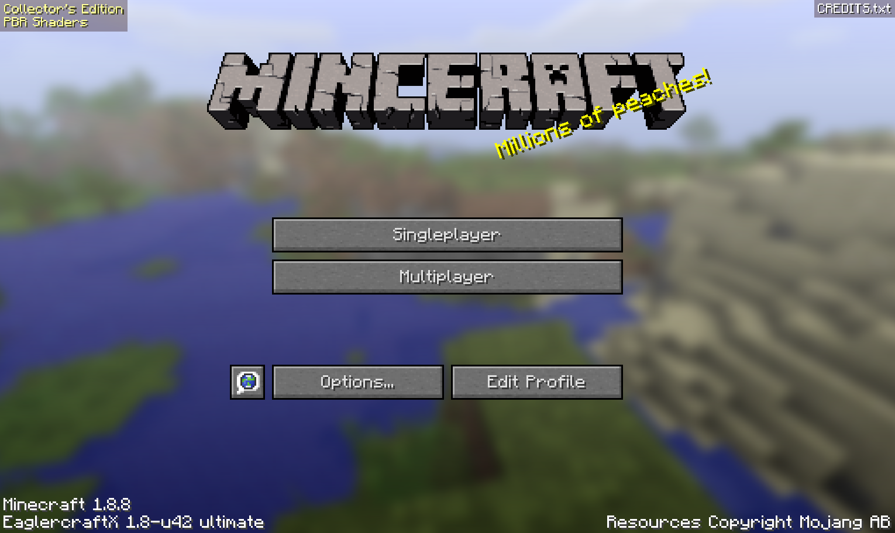

# terminal-minceraft

Minecraft inside your terminal, and inside your friend's terminal, in the same
world.


Two terminal panes, two players, one Minecraft world. The full clip, with the
game's own sound, is [media/terminal-minceraft.mp4](media/terminal-minceraft.mp4).
Every frame in both is bytes terminal-browser wrote to a terminal.

And an agent can play it, through the same keyboard and mouse you would use:


That is Claude Code, given a hotbar and told to build something. It looks,
places a block, looks again, and walks back to see what it made. Nobody scripted
the moves. [How to set that up](#let-an-agent-play) is further down, and it is
two commands.

### About the name

Minecraft has always had a rare title screen that spells itself Minceraft. Both
terminals rolled it on the day this was recorded, which is the first shot of the
clip, and it is where the name came from.



### Install (macOS & Linux):

```bash
curl -fsSL https://raw.githubusercontent.com/dcouple/terminal-minceraft/main/install.sh | bash
```

This repository is the wrapper. The installer downloads the game itself, one
74 MB EaglercraftX 1.8 html file, from the Eaglercraft archive on GitHub, pinned
to an exact commit and checked against a pinned sha256 before it is used.

### Usage

```
Usage: terminal-minceraft [options]

  terminal-minceraft                 Play in this terminal pane
  terminal-minceraft --split right   Play in a new pane beside what you are doing

Options:
  --client <path>       Use your own EaglercraftX offline client html
  --look <pixels>       Look speed for the arrow keys, in pixels of mouse
                        movement per second (default 520)
  --relay <wss url>     Signal shared worlds through this relay instead of the
                        ones the client ships with
  --split <direction>   Open in a new pane: right, left, down, up
  --size <fraction>     How much space a new split takes (0.2 to 0.95)
  --port <n>            Serve the game on this port (default 25585)
  --serve               Only start the server and print its url
  --windowed            Keep the browser toolbar, for debugging
  --debug               Print what the page is told about the mouse and keys
  --version             Print the version
  -h, --help            Print this help
```

You need a terminal that speaks the kitty graphics protocol: ghostty, kitty,
WezTerm, cmux, or the terminal inside VS Code. On macOS, `brew install --cask
ghostty`.

Fullscreen the terminal before you play. The game renders at whatever size the
pane is, so a bigger pane is a bigger, sharper Minecraft. The recording above
was made at 170 by 48 cells, which is 1530 by 912 pixels a pane.

The first launch shows a white screen that says "press any key to enable sound".
Press any key. Chromium keeps audio silent until you touch something, and
Eaglercraft waits there until you do.

### Controls

| Action | Key |
| --- | --- |
| Move | `W` `A` `S` `D` |
| Look | arrow keys, or the mouse |
| Jump | `space` |
| Sneak | `shift` |
| Sprint | `left ctrl`, or double tap `W` |
| Fly, in creative | double tap `space` |
| Mine, attack | left click |
| Place, use | right click |
| Inventory | `E` |
| Hotbar | `1` to `9` |
| Drop | `Q` |
| Chat and commands | `T` |
| Camera | `F5` |
| Debug screen | `F3` |
| Menu | `esc` |
| Quit the pane | `ctrl+q` |

Look is on the arrow keys because a terminal reports the mouse as a cell in a
grid, and Minecraft wants a mouse that moves by an amount rather than to a
place. The arrows are turned into that amount before the game sees them, so
they steer the same way a mouse does, with the same acceleration. `--look`
changes how fast. The mouse works too, since terminal-browser fills in the
distance between the last two cells it sent, so a drag across the pane turns
your head.

Blocks break the way you expect. Hold the left button, watch the ground give
way, keep going and you are in a hole:


Your worlds are saved. They live in the browser profile terminal-browser keeps,
under the port the game is served on, which is why the port is fixed. Running a
second game at the same time needs `--port 25586`, and it gets its own worlds.

### Multiplayer

It works, and it is the clip at the top of this page.

In a world, press `esc` and then **Invite**. Eaglercraft opens the world through
one of the public relays it ships with and prints a five character join code in
chat. Anyone else opens **Multiplayer**, finds the world in the list, and joins.
Two panes on the same laptop works; so does a friend on the other side of the
internet.

Two things worth knowing. Eaglercraft shared worlds go out through a relay on
the public internet, so they are not the local network the vanilla Minecraft LAN
button gives you, and the game says so on the way in. And the connection between
players is peer to peer, so as the host you are handing your IP address to
whoever joins. The game says that too.

`--relay wss://your-relay/` points it at a relay of your own.

### Let an agent play

The game runs in a browser, and a browser can be asked questions. With `--agent`
the wrapper opens a small control layer on the same port, and an agent gets the
two things a player has: something to see with, and something to act with. The
full clip from the top of this page is
[media/agent-plays.mp4](media/agent-plays.mp4).

Start a game with the interface on:

```bash
terminal-minceraft --agent
```

Then point Claude at it, once:

```bash
claude mcp add minceraft -- terminal-minceraft mcp
```

That is the whole setup. Ask Claude to look around and it will.

**The tools.** Small and orthogonal, because an agent composes better than it
remembers: `observe`, `screenshot`, `move`, `look`, `look_at`, `jump`, `mine`,
`use`, `select_slot`, `chat`, `stop`.

`observe` is the one that matters. It returns the world as JSON rather than as
pixels: where the player is, which way it is facing, health and hunger, what is
in the hotbar, the block the crosshair is on and its name, and every nearby
player and mob with the compass bearing to turn and face it. An agent that can
read that plays far better than one squinting at a picture, which is why
`screenshot` is there for the moments when seeing settles it, and not before.

**The same thing from a shell**, for scripted policies and for testing:

```bash
terminal-minceraft agent observe
terminal-minceraft agent look --yaw 90 --pitch 0
terminal-minceraft agent move forward 1.5 --sprint
terminal-minceraft agent look-at -249 66 260
terminal-minceraft agent mine 2
terminal-minceraft agent say "hello"
```

**The loop.** Observe, act, observe. A read is one round trip on loopback and
costs a few milliseconds, so an agent can afford to check itself after every
move, and should: `look_at` a block, `observe` to confirm the crosshair really
landed on it, then `mine`. Held keys are released when an action ends and by
`stop`, so an agent cannot walk away with a key stuck down.

**In multiplayer too.** An agent is another client in the world, so this works
the same in a shared world as it does alone. In the shot below, the agent has
found the other player, turned to face them, and walked over.


**How it is wired.** The page holds a GET open, the server answers it when a
tool call arrives, and the page posts the result back. Two ordinary requests, no
socket library, nothing to install. `web/agent.js` reads the game through
EaglerForge's ModAPI, which hands out live proxies onto the running Java heap,
and acts by dispatching the keyboard and mouse events the client already
listens for. The agent presses the same keys you would.

Two things worth knowing. The control layer listens on loopback with no
authentication, so anything already running on your machine can drive your
player while `--agent` is on; leave it off when you are not using it. And
`--agent` asks WebGL to preserve its drawing buffer so a screenshot can be taken
at any moment, which costs a little speed.

### How this was made

Two agents made this, each doing the job it is good at. I run my work inside
[Pane](https://github.com/dcouple/Pane), a workspace that gives every task its
own git worktree and agent terminal. A chat orchestrator sits above the agents,
a Claude Fable 5 session running the pane-orchestrator skill from
[dcouple/skills](https://github.com/dcouple/skills) with the workflow
conventions from [dcouple/orchestra](https://github.com/dcouple/orchestra). It
writes the briefs, dispatches the work, and carries my messages to agents while
they run.

The day after [terminal-doom](https://github.com/dcouple/terminal-doom) went up,
I sent the orchestrator this. Raw message, typos and all:

```
You know how yesterday we kicked off Terminal Doom? Can we kick off Terminal
EagleCraft? I think that would be sick. It's literally just like Minecraft in a
browser, and it's open source too. i think terminal ec will do better then doom.
my post didnt doo too well.https://github.com/Eaglercraft-Archive
```

It created a worktree, wrote a one-page brief, and handed it to a Claude Opus 5
agent. The brief set the ground rules: prove the two things that decide whether
this is possible at all before building anything, ship the wrapper and download
the game, and finish with a recording where every frame is real. Everything else
was the agent's to figure out. Eight more messages from me arrived while it was
building. One of them turned the deliverable from a singleplayer clip into two
terminals in one world, and one of them renamed the project after a title screen
the recording had already caught. All of them are in [BRIEF.md](BRIEF.md),
verbatim, including the typos.

My favourite part is the same as last time. The machine it works on has screen
recording switched off, which leaves the agent blind to the terminal it is
driving. So it uses a terminal it wrote. `scripts/capture.py` holds the far end
of a pty, answers the queries a real terminal answers, decodes the frames
terminal-browser transmits, and plays the game back down the same pipe.

That one file is the debugger, since every "is this working" question becomes a
png. It is the test suite, because a frame with Minecraft in it means the client
booted, chromium gave it a GL context, the escape codes were well formed, and
the keys arrived. And it is the camera. It grew a mouse for this project,
because Minecraft has menus, and a control channel, because a game you have to
script in advance is a game you debug sixty seconds at a time.

### How does it work?

terminal-minceraft combines [terminal-browser](https://github.com/zenbu-labs/terminal-browser)
(a browser in the terminal) and EaglercraftX 1.8 (Minecraft 1.8.8 compiled to
JavaScript with TeaVM). A small server on loopback hands the game to the
browser, injecting one script of ours on the way through, which is the only
place the wrapper touches the game.

So the frames go Minecraft, WebGL, chromium, escape codes, your terminal, about
ninety times a second. Your keys make the same trip back. It works over ssh for
the same reason terminal-browser does: the frames are only bytes on the wire.

Three things the wrapper does to the page, all in `web/look.js`:

- **A pointer lock the game can believe in.** Minecraft gates look on
  `document.pointerLockElement` and asks for the lock with
  `canvas.requestPointerLock()`. An offscreen chromium in a terminal pane has no
  cursor to lock, so the lock is kept in JavaScript instead: same API, same
  events, and the game is satisfied.
- **Arrow keys as mouse movement.** The game reads `movementX` and `movementY`
  off mousemove and adds them to the look it has accumulated. Synthesised events
  carrying those fields are the same arithmetic a real mouse lands in.
- **Three launch options off.** An update check, an update download, and asking
  the relays whether they have heard of a newer client. With those off, a
  singleplayer game touches nothing outside your machine.

### Speed

Better than expected. The plan assumed software GL through swiftshader; what
actually happens is that Electron's offscreen renderer hands WebGL to the real
GPU and reads the composited frame back, so on an M1 Pro the game reports
**120 fps** and terminal-browser painted about **90 frames a second** into the
pipe across the four minute recording. The debug screen says it plainly:


`ANGLE (Apple, ANGLE Metal Renderer: Apple M1 Pro)`, `WebGL 2.0`, `Java: TeaVM`,
`Minecraft 1.8.8 (1.8.8/eagler)`. On a machine with no GPU the same path falls
back to swiftshader and will be slower; that number is from a laptop.

### Testing it without a screen

`scripts/capture.py`, from the story above, is a normal way to test this thing.
Script it in advance:

```bash
scripts/capture.py --out media --video demo.mp4 --seconds 90 --isolate /tmp/tec \
  --key 6:space --click 42:0.5:0.44 --hold 60:2.5:w --mine 70:1.6:0.5:0.55 \
  -- bin/terminal-minceraft
```

Or play it while it runs, which is what the recording was made with:

```bash
scripts/capture.py --out media --seconds 0 --isolate /tmp/tec \
  --control /tmp/game.ctl -- bin/terminal-minceraft
echo "key space"            >> /tmp/game.ctl
echo "click 0.499 0.440"    >> /tmp/game.ctl
echo "type /time set day"   >> /tmp/game.ctl
echo "still now"            >> /tmp/game.ctl
```

`--isolate` gives a run its own browser daemon, profile and saved worlds, which
is what lets two of them play together. `scripts/polish-demo.py` puts two of
those captures in mac windows on a gradient and muxes the sound back in.

### Windows

The kitty graphics protocol is thin on the ground on Windows, so the build
targets macOS and Linux. Installing the Linux version inside
[WSL](https://learn.microsoft.com/en-us/windows/wsl/install) works.

### Licence

This project exists to demonstrate that a browser game can be rendered into a
terminal pane and played there. It is not a way to play Minecraft without paying
for it. Minecraft is a commercial product and playing it requires a licence from
Mojang, so buy your own copy: https://www.minecraft.net

Three parts, spelled out in [NOTICE](NOTICE). The wrapper in this repository is
MIT. Eaglercraft is downloaded when you install, is not redistributed here, and
carries its own terms; it contains decompiled Minecraft code and repositories
hosting it have been taken down before. Minecraft is a trademark of Mojang
Synergies AB, part of Microsoft, and this project is independent of them.

### Thanks

- [terminal-browser](https://github.com/zenbu-labs/terminal-browser), which does the hard part
- [Pane](https://github.com/dcouple/Pane), [dcouple/skills](https://github.com/dcouple/skills) and [dcouple/orchestra](https://github.com/dcouple/orchestra), the workspace and orchestration this was built inside
- [terminal-code](https://github.com/zenbu-labs/terminal-code), which showed a web app in a terminal pane can be a real product
- [terminal-doom](https://github.com/dcouple/terminal-doom), whose capture harness this one grew out of
- lax1dude and everyone who worked on Eaglercraft, and [EaglerForge](https://github.com/EaglerForge)
- Mojang, for Minecraft
