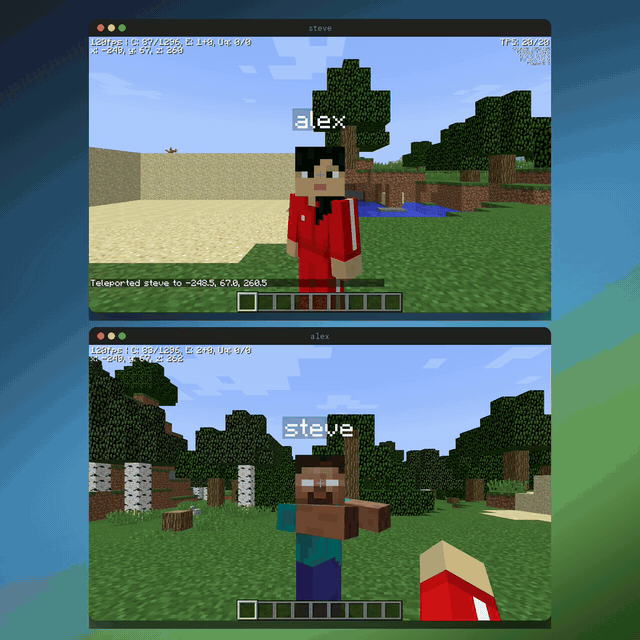
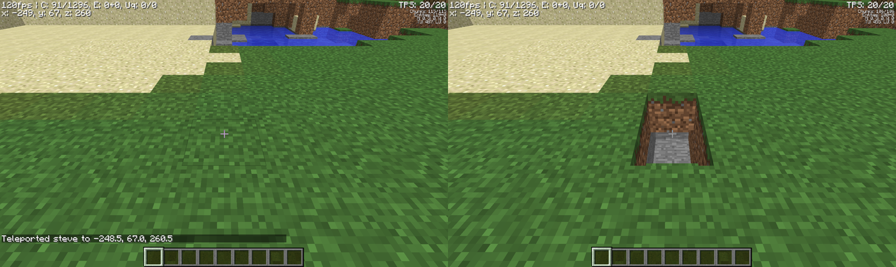
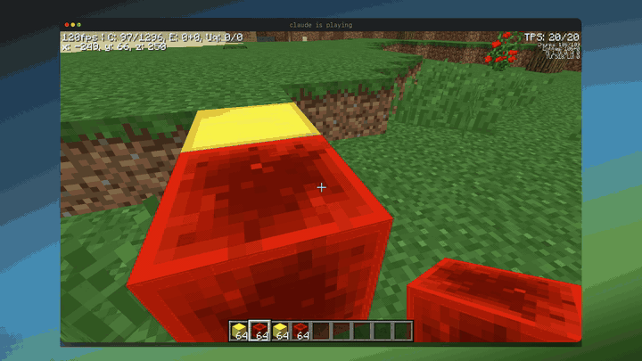
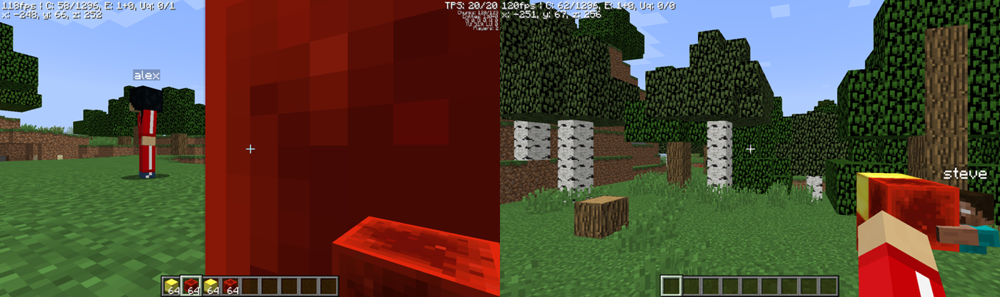
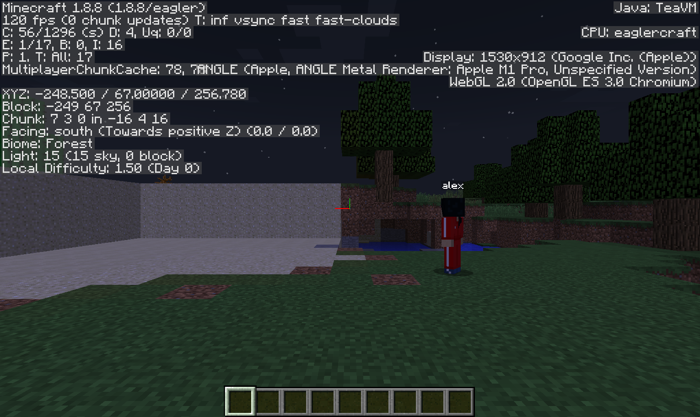

# terminal-minceraft

Minecraft inside your terminal, and inside your friend's terminal, in the same
world.



Two terminals, two players, one world. The full clip with the game's own sound
is [media/terminal-minceraft.mp4](media/terminal-minceraft.mp4).

### Install (macOS & Linux):

```bash
curl -fsSL https://raw.githubusercontent.com/dcouple/terminal-minceraft/main/install.sh | bash
```

This repository is the wrapper. The installer downloads the game, one 74 MB
EaglercraftX 1.8 html file, pinned to an exact commit and checked against a
pinned sha256.

### Usage

```
Usage: terminal-minceraft [options]

  terminal-minceraft                 Play in this terminal pane
  terminal-minceraft --split right   Play in a new pane beside what you are doing
  terminal-minceraft --agent         Play, and let an agent play too
  terminal-minceraft mcp             Run the MCP server, for an agent to connect to
  terminal-minceraft agent <cmd>     Drive a running game from a shell

Options:
  --client <path>       Use your own EaglercraftX offline client html
  --look <pixels>       Look speed for the arrow keys, in pixels of mouse
                        movement per second (default 520)
  --agent               Let an agent play. Opens the control layer on the same
                        port, which the MCP server and "agent" subcommand use
  --relay <wss url>     Signal shared worlds through this relay instead of the
                        ones the client ships with
  --debug               Print what the page is told about the mouse and keys
  --split <direction>   Open in a new pane: right, left, down, up
  --size <fraction>     How much space a new split takes (0.2 to 0.95)
  --port <n>            Serve the game on this port (default 25585). The port
                        is the origin, and the origin is where your worlds and
                        settings live, so a second game needs a second port
  --serve               Only start the server, print its url, and stay in the
                        foreground (drive it yourself with terminal-browser)
  --windowed            Keep the browser toolbar, for debugging
  --version             Print the version
  -h, --help            Print this help
```

You need a terminal that speaks the kitty graphics protocol: ghostty, kitty,
WezTerm, cmux, or the terminal inside VS Code. On macOS, `brew install --cask
ghostty`.

The first launch waits on a white screen that says "press any key to enable
sound". Press any key. Chromium keeps audio silent until you touch something.

### Controls

| Action | Key |
| --- | --- |
| Move | `W` `A` `S` `D` |
| Look | arrow keys, or the mouse |
| Jump | `space` |
| Sneak | `shift` |
| Sprint | `left ctrl`, or double tap `W` |
| Fly, in creative | double tap `space` |
| Mine, attack | left click |
| Place, use | right click |
| Inventory | `E` |
| Hotbar | `1` to `9` |
| Drop | `Q` |
| Chat and commands | `T` |
| Camera | `F5` |
| Debug screen | `F3` |
| Menu | `esc` |
| Quit the pane | `ctrl+q` |

Look is on the arrow keys because a terminal reports the mouse as a cell in a
grid, and Minecraft wants a mouse that moves by an amount. The arrows are turned
into that amount before the game sees them. `--look` changes the speed, and a
mouse drag across the pane works too.

Worlds are saved, under the port the game is served on, which is why the port is
fixed. A second game at the same time needs `--port 25586` and gets its own.



### Multiplayer

In a world, press `esc` and then **Invite**. Eaglercraft opens the world through
one of the public relays it ships with and prints a five character join code in
chat. Anyone else opens **Multiplayer**, finds the world in the list, and joins.
Two panes on one laptop, or a friend anywhere.

Shared worlds go out through a relay on the public internet rather than your
local network, and the connection between players is peer to peer, so joiners
can see your IP address. The game says both on the way in. `--relay wss://...`
points it at a relay of your own.

### Let an agent play



Claude Code, given a hotbar and told to build something. Two commands:

```bash
terminal-minceraft --agent
claude mcp add minceraft -- terminal-minceraft mcp
```

Tools: `observe`, `screenshot`, `move`, `look`, `look_at`, `jump`, `mine`,
`use`, `select_slot`, `chat`, `stop`.

`observe` returns the world as JSON rather than pixels: position, facing, health
and hunger, the hotbar, the block the crosshair is on and its name, and nearby
players and mobs with the bearing to turn and face each one. An agent reading
that plays better than one squinting at a picture, so `screenshot` is there for
the moments when seeing settles it, and not before.

The same vocabulary from a shell:

```bash
terminal-minceraft agent observe
terminal-minceraft agent look --yaw 90 --pitch 0
terminal-minceraft agent move forward 1.5 --sprint
terminal-minceraft agent look-at -249 66 260
terminal-minceraft agent mine 2
terminal-minceraft agent say "hello"
```

Observe, act, observe. A read is one round trip on loopback, so an agent can
check itself after every move and should: `look_at` a block, `observe` that the
crosshair landed on it, then `mine`.

An agent is another client in the world, so this works in a shared world too.
Below it has found the other player, turned to face them, and walked over.



Two things to know. The control layer listens on loopback with no
authentication, so anything running on your machine can drive your player while
`--agent` is on. And `--agent` asks WebGL to preserve its drawing buffer so a
screenshot can be taken at any moment, which costs a little speed.

### How does it work?

terminal-minceraft combines [terminal-browser](https://github.com/zenbu-labs/terminal-browser)
(a browser in the terminal) and EaglercraftX 1.8 (Minecraft 1.8.8 compiled to
JavaScript with TeaVM). A server on loopback hands the game to the browser and
injects one script of ours on the way through, which is the only place the
wrapper touches the game.

Frames go Minecraft, WebGL, chromium, escape codes, your terminal, about ninety
times a second. Keys make the same trip back. It works over ssh because the
frames are only bytes on the wire.

`web/look.js` keeps a pointer lock the game believes in, since an offscreen
chromium has no cursor to lock, turns arrow keys into the relative mouse
movement Minecraft reads for look, and switches off the client's update check so
a singleplayer game touches nothing outside your machine. `web/agent.js` is the
agent half, reading state through EaglerForge's ModAPI and acting by dispatching
the events the client already listens for.

### Speed

Better than expected. The plan assumed software GL; what happens is that
Electron's offscreen renderer hands WebGL to the real GPU and reads the frame
back, so on an M1 Pro the game reports **120 fps** and terminal-browser painted
about **90 frames a second** into the pipe.



On a machine with no GPU the same path falls back to swiftshader and is slower.

### Testing it without a screen

`scripts/capture.py` is a terminal. It holds the far end of a pty, answers the
queries a real terminal answers, decodes the frames terminal-browser transmits,
and plays the game back down the same pipe. Script a run in advance:

```bash
scripts/capture.py --out media --video demo.mp4 --seconds 90 --isolate /tmp/tmc \
  --key 6:space --click 42:0.5:0.44 --hold 60:2.5:w --mine 70:1.6:0.5:0.55 \
  -- bin/terminal-minceraft
```

Or play it while it runs, which is how the clip at the top was made:

```bash
scripts/capture.py --out media --seconds 0 --isolate /tmp/tmc \
  --control /tmp/game.ctl -- bin/terminal-minceraft
echo "key space"            >> /tmp/game.ctl
echo "click 0.499 0.440"    >> /tmp/game.ctl
echo "type /time set day"   >> /tmp/game.ctl
echo "still now"            >> /tmp/game.ctl
```

`--isolate` gives a run its own browser daemon, profile and saved worlds, which
is what lets two of them play together. `scripts/polish-demo.py` puts the
captures in mac windows on a gradient and muxes the sound back in.

### How this was made

Two agents, each doing the job it is good at. I run my work inside
[Pane](https://github.com/dcouple/Pane), which gives every task its own git
worktree and agent terminal. A chat orchestrator sits above them, a Claude Fable
5 session running the pane-orchestrator skill from
[dcouple/skills](https://github.com/dcouple/skills) with the conventions from
[dcouple/orchestra](https://github.com/dcouple/orchestra). It writes the briefs
and carries my messages to agents while they run.

The day after [terminal-doom](https://github.com/dcouple/terminal-doom) went up,
I sent it this. Typos and all:

```
You know how yesterday we kicked off Terminal Doom? Can we kick off Terminal
EagleCraft? I think that would be sick. It's literally just like Minecraft in a
browser, and it's open source too. i think terminal ec will do better then doom.
my post didnt doo too well.https://github.com/Eaglercraft-Archive
```

It wrote a brief and handed it to a Claude Opus 5 agent. Eight more messages
from me arrived while it was building, one of which turned the deliverable from
a singleplayer clip into two terminals in one world. All of them are in
[BRIEF.md](BRIEF.md), verbatim.

The machine has screen recording switched off, so the agent could not see the
terminal it was driving. It wrote its own terminal instead, which is
`scripts/capture.py` above. That file was the debugger, since every "is this
working" question became a png, and the test suite, since a frame with Minecraft
in it means the client booted and the keys arrived, and the camera.

### Windows

The kitty graphics protocol is thin on the ground on Windows, so the build
targets macOS and Linux. Installing the Linux version inside
[WSL](https://learn.microsoft.com/en-us/windows/wsl/install) works.

### Licence

This project exists to demonstrate that a browser game can be rendered into a
terminal pane and played there. It is not a way to play Minecraft without paying
for it, so buy your own copy: https://www.minecraft.net

Three parts, spelled out in [NOTICE](NOTICE). The wrapper here is MIT.
Eaglercraft is downloaded when you install, is not redistributed here, and
carries its own terms. Minecraft is a trademark of Mojang Synergies AB, part of
Microsoft, and this project is independent of them.

### Thanks

- [terminal-browser](https://github.com/zenbu-labs/terminal-browser), which does the hard part
- [Pane](https://github.com/dcouple/Pane), [dcouple/skills](https://github.com/dcouple/skills) and [dcouple/orchestra](https://github.com/dcouple/orchestra)
- [terminal-code](https://github.com/zenbu-labs/terminal-code), which showed a web app in a terminal pane can be a real product
- [terminal-doom](https://github.com/dcouple/terminal-doom), whose capture harness this one grew out of
- lax1dude and everyone who worked on Eaglercraft, and [EaglerForge](https://github.com/EaglerForge)
- Mojang, for Minecraft
